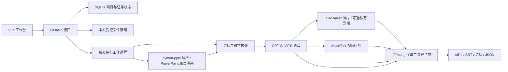

# 数字人教师慕课生成系统

将课程 PPT、教师照片或视频、参考语音制作成可审核、可恢复、可导出的中文慕课视频。参考语音用于教师音色，无需提供完整课时录音。

**当前状态：可试用，正在预验收，首版尚未正式完成。** 已有真实照片与视频路径成片；教学正确性、音色、人物一致性和口型等人工评审仍待完成。需求基线为 [V1.1](数字人教师慕课生成系统需求文档_V1.1.docx)，最新记录见 [项目状态](docs/PROJECT_STATUS.md)。本文更新于 2026-10-10。

## 使用流程

1. 上传一份课程 PPT、一份参考语音，以及教师照片或视频（二选一）。
2. 点击“生成慕课视频”，系统解析和渲染原课件、准备讲稿、合成语音、驱动人物，再制作字幕和整课视频。
3. 播放或下载完整的**未审核草稿**，由教师检查内容和视听质量。
4. 教师主动确认成片；需要修订时，可进入高级工作台编辑、试听和局部重做。

普通入口允许先生成完整草稿，再进行教师确认。高级正式生成保留审核与预检门槛；教师成片确认不会自动替代全部正式验收。具体规则见 [一键制作规格](specs/ONE_CLICK_FLOW.md)。

## 已实现的能力

| 能力 | 当前实现 |
| --- | --- |
| 项目与素材 | 上传检查、项目保存与重开、复制、课件重选及来源保留 |
| 原课件处理 | 结构解析与原页渲染分开保存，逐页配置保留稳定的来源映射 |
| 三种讲稿入口 | AI 生成、PPT 备注原文、外部逐页稿；支持编辑、版本和教学核查 |
| 教师语音 | GPT-SoVITS 音色合成、参考片段选择、逐页试听和实际语音时间记录 |
| 两种人物路径 | SadTalker 照片驱动、MuseTalk 视频序列驱动；人物由各页当前音频驱动 |
| 字幕与合成 | 显示稿、读法稿与控制事件分开存储；按实际语音建立时间轴，支持布局及人物显隐 |
| 异步任务 | SQLite 持久化、串行工作进程、有限重试、取消、恢复与真实阶段进度 |
| 局部重做 | 按讲稿、音色、模型及布局变化更新受影响的缓存和后续时间偏移 |
| 四类导出 | MP4 视频、SRT 字幕、逐页 TXT 或 Markdown 讲稿、JSON 任务清单 |
| 可选云端照片计算 | 按课程配置私有 SadTalker 服务、连接检查、幂等提交、结果查询与校验下载 |

这些功能的实现与工程检查不代表教学和视听质量已经通过。原文稿和外部稿不会自动润色；主动隐藏人物的页面仍保留讲解和字幕。

## 实测进展与待完成事项

| 验证范围 | 已有证据与边界 |
| --- | --- |
| 照片整课 | 24 页、12 分 00.6 秒、1080p / 25 fps 的真实草稿；完整解码、四类导出及浏览器播放下载已有核查，见 [最终复验](docs/evidence/M3/lecture9-finish.md) |
| 两条人物路径 | 照片、视频各完成过 10 页、163.88 秒的真实外部稿课程；属于未审核草稿，见 [双路径报告](docs/evidence/M3/long-course-validation.md) |
| 讲稿可靠性 | 已实现正文先保存、独立教学核查、有限请求及步骤恢复；真实限流和失败历史保留，见 [实现记录](docs/evidence/M2/draft-reliability-implementation.md) |
| 云端照片 | 已有 30 秒和约 82 秒真实样片、冷热与批次测量；不等于云端整课或质量验收通过，见 [实测报告](docs/evidence/M3/cloud-photo-real-benchmark.md) |
| 恢复与缓存 | 已有工程故障注入、实际生成期重启和局部重做证据，见 [M4 预验收](docs/evidence/M4/README.md) |

M1–M4 均尚未正式退出通过。主要剩余工作：

- 修正已有数字和词语读法问题，完成教学内容、音色、人物、口型、字幕及连贯性人工评审。
- 冻结正式验收指标，补齐授权教师、课件、两条路径的足额基线任务和接近配置上限的长任务。
- 完成另机环境重建、多浏览器兼容性及部署复验。

验收数量、评分与 AC01–AC18 要求见 [M4 规格](specs/M4-acceptance.spec.md) 和 [待确认评审包](docs/M4_REVIEW.md)。已有任务的缓存复用耗时不能作为全新课程的生成速度承诺。

## 技术结构



模型使用独立环境或独立服务，避免覆盖 Python/CUDA 依赖。工作台默认只监听 `127.0.0.1:8765`，通过本机会话访问；当前以单教师、单课件、中文普通话、异步离线制作为范围，尚无多用户账户与按用户授权隔离。

## 启动与环境准备

当前本机方案依赖 Windows、Python 3.10、Node.js/npm、FFmpeg/ffprobe、已安装的 Microsoft PowerPoint，以及各模型所需的独立环境与权重。具体版本、GPU 配置和模型摘要见 [部署说明](docs/DEPLOYMENT.md) 与 [版本清单](docs/evidence/M4/version-inventory.json)。

### 已配置的本机

在项目根目录用 PowerShell 执行：

```powershell
.\.venv-m1\Scripts\python.exe -m mooc_m2 --port 8765 --open
```

服务会打开带一次登录票据的工作台。保持终端运行，按 `Ctrl+C` 停止；电脑重启后需重新启动。若服务已经运行，打开现有工作台：

```powershell
.\.venv-m1\Scripts\python.exe tools/m2_open.py
```

允许运行本地 PowerShell 脚本的环境，也可使用 `tools/m2_start.ps1`；它会检查前端构建并复用健康的已运行服务。遇到脚本执行策略限制时，可使用上述 Python 入口。

### 从 GitHub 克隆到新机器

```powershell
git clone https://github.com/xukun4886-blip/mooc-teacher-generator.git
Set-Location -LiteralPath 'mooc-teacher-generator'
```

私有仓库需要具有访问权限的 GitHub 账号。**克隆后需完成环境、权重和本地配置准备才能生成课程**，另机完整重建目前仍待验证：

1. 按 [部署说明](docs/DEPLOYMENT.md) 建立控制环境，使用 `requirements-m2.txt` 安装控制端依赖；分别准备模型环境与权重。
2. 在 `frontend` 中执行 `npm.cmd ci --no-audit --no-fund` 和 `npm.cmd run build`。
3. 依据 [M1 模板](config/m1.example.json) 配置 `config/m1.local.json` 中的真实模型与工具；依据 [M2 模板](config/m2.example.json) 配置 `config/m2.local.json` 中的存储与讲稿服务。模板为空的服务项需要补齐，不能直接证明能力可用。
4. 将服务密钥放入配置指定的环境变量，核实课件外传授权、模型能力和输入兼容性，再启动工作台。

可选云端照片计算的部署与连接步骤见 [云端照片教程](docs/CLOUD_PHOTO_GUIDE.md) 和 [工作进程协议](specs/CLOUD_PHOTO_WORKER.md)。它只将明确授权的照片及驱动音频交给指定服务，课程数据库、审核、字幕和最终合成仍在本机。

## 检查与已知限制

在已准备好的控制环境中执行：

```powershell
.\.venv-m1\Scripts\python.exe -m pytest -q
.\.venv-m1\Scripts\python.exe -m mooc_m1 inventory --output storage/environment-check.json
.\.venv-m1\Scripts\python.exe -m mooc_m1 preflight --manifest config/samples.example.json --output storage/preflight-check.json
```

示例素材清单使用未配置的输入，预检退出码 `2` 表示正确阻断，不代表已生成有效媒体。模拟测试验证编排，真实人物、语音和教学质量仍需要实测与人工评审。

- 外部讲稿服务繁忙、限流、断网或截断时仍可能失败；系统保留已完成步骤，缺页整课不会发布为成功。
- 原页渲染依赖本机 PowerPoint 和字体；已有独立实例创建失败记录，不能据此直接判定课件损坏。
- 人物生成耗时受硬件、片段长度、模型加载与缓存影响；1080p 合成画布不会提升原教师素材的细节。
- 当前工作台用于本机访问。对外分享和多人部署仍需账户、授权隔离及部署验证。

## 仓库与数据备份

| 路径 | 用途 |
| --- | --- |
| `frontend/` | Vue 工作台 |
| `mooc_m1/` | 素材、课件、模型适配及能力预检 |
| `mooc_m2/` | FastAPI、项目存储、讲稿与内容链路 |
| `mooc_m3/` | 人物、字幕、视频合成与媒体缓存 |
| `mooc_cloud/` | 可选私有云端照片工作进程 |
| `config/` | 配置模板与模型环境依赖入口 |
| `specs/` | 阶段规格、接口及需求追踪 |
| `tests/`、`tools/` | 行为测试、启动与验证工具 |
| `docs/`、`.agents/skills/` | 状态、文字证据、操作说明及协作方法 |

GitHub 保存源码、需求、配置模板、依赖锁定文件、测试和文字记录。教师素材、课程数据库、生成视频、模型权重、运行环境、本地配置、凭据与证据截图留在本机受控存储；这些文件已由 [`.gitignore`](.gitignore) 排除。

GitHub 源码备份不能替代课程数据备份。部分文字证据引用的截图及媒体需要在原机器或授权备份中查看。详细范围与迁移限制见 [Git 备份说明](docs/GIT_BACKUP.md)；第三方组件使用条件见 [本地核查记录](docs/evidence/M1/model-usage-local.md)。素材不默认用于训练。

## 文档入口

| 文档 | 内容 |
| --- | --- |
| [教师操作指南](docs/TEACHER_GUIDE.md) | 上传、制作、确认及异常处理 |
| [部署说明](docs/DEPLOYMENT.md) | 环境、启动、配置与数据迁移 |
| [项目状态](docs/PROJECT_STATUS.md) | 最新结果、证据、限制与下一步 |
| [阶段索引](specs/README.md) / [需求追踪](specs/TRACEABILITY.md) | M1–M4 与 FR/NFR/AC 对应关系 |
| [M4 预验收](docs/evidence/M4/README.md) | 已执行检查及未通过项 |
| [项目协作规则](AGENTS.md) | 实施方法、产品不变量与完成标准 |
