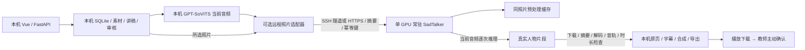

# 本机工作台＋指定云端 SadTalker：最小接口改造

日期：2026-10-09。前一轮[性能诊断与方案](performance-cloud-sadtalker-plan.md)和[原始诊断数据](performance-cloud-sadtalker-diagnostic.json)保留。本轮用户追加授权修改现有系统，在 Web 增加云端接口；用户随后提供已有服务器并允许指定服务器使用30秒和82秒样片，说明不必以预算信息阻塞。没有购买新实例，不生成整课，不提交/推送或对外发布工作台。

## 最小切片与真实状态

- 现有本机 SadTalker 默认路径保留。网页“高级设置 → 照片数字人处理”可选择本机/指定云服务器；高级编辑素材页也提供同一控件。PPT、讲稿版本、语音、任务 SQLite、审核、字幕与成片合成继续在本机。视频路径继续使用原 MuseTalk。
- 当前 Lecture 9 的配置没有切换云端，旧成片、素材和教师确认保持。界面中选择但不保存只改变表单；保存才创建版本与切换历史。复制项目默认回到本机，防止素材外传授权自动继承。
- 切换云端会改变M1评审绑定，本机原照片样片标为不兼容，不能继承本机人工质量结论。当前正式云端评审证据尚未形成，阶段和正式质量仍待评。
- 新增客户端、带认证的独立单 GPU 服务、SQLite 云端队列、常驻模型与照片预处理缓存实现。8个独立真实样片已完成，自动解码/音轨/时长/摘要检查通过；人工人物/口型评审仍待完成。最终耗时、显存、缓存边界与12分钟估算见[真实样片报告](cloud-photo-real-benchmark.md)，模拟测试不证明模型质量。
- 首轮全套工程回归118项通过（266.89秒）；补充摘要错配测试后云端专项8项通过（20.84秒）。完整证据见[回归 XML](cloud-photo-regression.xml)、[专项 XML](cloud-photo-specialized.xml)。Vue生产构建通过。后续修改和云端实测以本轮最终记录为准，不把这份中间记录当能力通过。
- 最终补齐云端M1评审绑定失效、运行环境阻断后，全套119项通过（290.94秒）。原Python1条Starlette/httpx弃用告警保留；未据此扩大依赖升级范围。



对应 M1-F04/F06、M2-F06、M3-F01/F04/F05/F06；FR09/13/14/15/18/19、NFR01–03/05–08、AC14–17 的工程部分。人工质量、正式审核、阶段退出和全新课程性能仍不计通过。

## 指定服务器只读核实

用户提供 AutoDL SSH 地址，工作区不保存 SSH 密码。首次 SSH 实测：Ubuntu22.04.5/Linux5.15；平台标称16核、90GB内存；`nvidia-smi`报告 RTX4080 SUPER、32760MiB、驱动595.71.05/CUDA最高支持13.2、初始显存1MiB/利用率0。这里的32760MiB是vGPU可见配额，不能推断独占物理卡、实际SM份额或与24GB4090等速。

原环境 `/root/miniconda3` 为 Python3.12.3、torch2.8.0+cu128；非交互SSH的PATH甚至找不到`python`。没有FFmpeg和SadTalker API。为保持原环境，独立目录 `/root/autodl-tmp/mooc-cloud` 准备 Python3.10、FFmpeg、同一 SadTalker源码及四份SHA256相同的权重；系统盘30GB/数据盘50GB，初始数据盘基本为空。安装时间和首次模型准备不计入样片稳态推理，也不省略于端到端冷部署费用。

模型代码与权重包约1.329GB，经SSH上传约168秒；该包不含用户教师素材或Lecture 9文件。普通云端pip下载遭遇约0.15–0.2MB/s的连接瓶颈，不能把环境安装进度写成服务就绪。大依赖下载工具只接受HTTPS和官方SHA256，支持有界分段及保留分块恢复；最终完整SHA256通过才发布wheel。云端API须分别报告连接、依赖阻断、常驻状态及质量未验证。

初次部署历史记录：云端API经工作台`photo-server/check`调用，HTTP200、`ready=false`，如实返回尚缺torch/torchvision及其他模型依赖；未上传教师素材或生成媒体。见[原始健康JSON](cloud-photo-server-health.json)。图形网页也完成同一请求并显示模型未就绪/依赖阻断，见[网页截图](cloud-photo-web.jpg)。环境安装阻断不能归因于GPU推理能力；当时没有云端加速实测。随后独立环境安装及实际导入检查完成，最终ready=true/模型已常驻，8个真实样片完成；见[最终健康](cloud-photo-server-final-health.json)、[网页就绪证据](cloud-photo-web-ready.jpg)和[真实对照](cloud-photo-real-benchmark.md)。

[保留核查](cloud-photo-preservation-after.json)：Lecture9项目与已完成最新draft快照完全相同，原完整任务与补修前记录一致，原证据和成果SHA相同；M1/M3审核、缓存、历史表未变。会话中出现Lecture8新项目及4项素材任务，因此不声称整个数据库所有表未变，也不回滚这些并行工作台活动。

## 配置与调用契约

工作台接口需本机会话，地址：

| 接口 | 行为 |
| --- | --- |
| `POST /api/projects/{pid}/photo-server/check` | 接收未保存的服务器设置，读取带认证`/v1/health`；不上传、不生成、不修改课程 |
| `PUT /api/projects/{pid}/photo-server` | 带当前revision保存；运行中的项目拒绝切换；连接/版本/报价/当前课程外传授权不足则拒绝；记录切换历史 |

配置字段：`mode=local/cloud`、`url`、`token_env=MOOC_CLOUD_TOKEN`、`batch_size=1/2/4`、`timeout_seconds=30..7200`、`allow_uploads`、`allow_paid`、`max_cost`。服务健康记录锁定完整源码、四份权重、运行环境、适配器实现摘要与256/full/25fps/无增强配置；入队快照固定它们。密钥仅取本机环境变量，不存SQLite或讲稿/清单。服务器变化必须重新检查并保存，不自动降级本机。

默认要求HTTPS，禁用环境代理和重定向，避免凭据跟随重定向。用户提供的是SSH，本轮仅在本机配置显式启用`cloud_loopback_tunnel`，允许`http://127.0.0.1:8787`这一已加密SSH隧道端点；工作进程仍只绑定远端127.0.0.1。没有开放云端公网API端口。

云端协议 `mooc.photo-worker.v1`：

| 接口 | 内容 |
| --- | --- |
| `GET /v1/health` | 真实配置/版本/依赖阻断/价格声明/模型是否已加载；不推理 |
| `HEAD/PUT /v1/blobs/{sha}` | 教师照片或当前驱动音频；完整摘要、真实格式检查通过才发布；同摘要命中不重复上传 |
| `POST /v1/jobs` | 幂等键、照片/音频/模型摘要、batch、运行时限与API计算授权 |
| `GET /v1/jobs/{id}` | SQLite状态、输入绑定、计时、峰值显存、输出摘要；失败记录保留 |
| `GET /v1/jobs/{id}/result` | 仅完成任务下载；支持Range续传；拒绝损坏/摘要变化 |
| `POST /v1/jobs/{id}/cancel` | 取消；模型每帧检查取消/时限；晚到结果不能覆盖取消 |

单租户Bearer令牌访问全部受控工作进程任务，适用于当前单教师/独立GPU主机。并非多教师共享SaaS权限方案。模型/素材不默认用于训练，没有自动删除或云平台账单控制。

## 断线、恢复与缓存边界

客户端先把收据落到本项目`m3/native/requests/{operation}/remote-receipt.json`，再POST；稳定逻辑操作由本地媒体任务ID/片段ID及当前输入摘要组成。提交响应丢失也重用相同幂等键；本机进程重启可查询同一云端任务。下载`.part`按Range续传，并在完成后重新校验完整摘要和现有视频/音轨解码、异常静音与时长。

输入上传首版以整blob为单位：断线后未发布的半份上传不会成为有效输入，恢复重新上传该blob；未实现输入分块续传。当前最长82秒WAV约数MB，该限制先实测传输是否成为瓶颈。照片和已上传的当前音频SHA命中可免重复传输；不把命中完整人物输出的查询耗时当全新推理。

云端单队列、单GPU工作线程，进程锁阻止多个worker竞争。重启只恢复running任务，最多两次恢复；每次运行独立execution目录，原失败日志/输出保留。网络问题保留同一远程任务；明确云端failed/canceled后，本机有限重试才建立新attempt幂等键。没有无穷重试、无声本机回退或跨音频口型复用。

照片预处理缓存键含照片SHA、源码/权重/实现/运行环境、full/256等参数。缓存保存原照片字节、裁剪图、首帧3DMM和crop_info，命中先核实文件SHA。音频预处理、audio2coeff和人物渲染每次仍从当前音频执行。缓存与本机原人物缓存独立命名空间；改稿保持TTS既有失效规则，云/本机切换不复用错误人物；切回本机可重新命中原有效本机缓存。语音和PPT缓存无需因服务器切换而无条件重做。

首版不重构TTS/云端人物/合成的阶段调度；本机仍按页串行。这使最小切片更易回滚，也意味着不能宣称整课耗时接近纯GPU人物时间。

## 部署方法与运行要求

配置样例：[cloud-worker.example.json](../../../config/cloud-worker.example.json)。独立API依赖：[requirements-cloud-api.txt](../../../requirements-cloud-api.txt)。SadTalker模型依赖沿用[固定清单](../../../config/sad-runtime.requirements.txt)。Python3.10、torch2.0.1+cu118/torchvision0.15.2+cu118为本轮云端兼容候选，必须实测；本机原Python3.10/torch1.12.1+cu113保持。至少16–24GB GPU、建议32GB主机RAM起测；本机长页GPU峰值约1.7GB allocated/2.0GB reserved不意味着batch4必然只用8GB，峰值以样片为准。

同一仓库内包含`mooc_cloud/mooc_m1/mooc_m2`依赖模块，源码在云端的应用根目录下，SadTalker另存独立子目录，运行根为绝对路径。4份权重必须通过样例中的摘要检查。API令牌生成后放独立受控环境变量；云端root可读`runtime.env`权限0600，仅该单租户工作进程使用，工作台取环境变量；不把SSH密码、令牌写入JSON配置或Git。

```bash
# 云端，依赖就绪后；一个进程，禁止 workers>1
cd /root/autodl-tmp/mooc-cloud
set -a
. ./runtime.env
set +a
env/bin/python -m mooc_cloud --config config/cloud.remote.json --host 127.0.0.1 --port 8787
```

```powershell
# 本机SSH隧道；密码只在交互提示中输入。先在独立管理环境安装paramiko。
# 工作台须空闲且已停止，以下启动器会给新工作台进程注入API令牌。
python tools/cloud_ssh_bridge.py --host connect.westc.seetacloud.com --port 57089 --workbench D:\XuTao_Task
```

需要常驻时以平台受管进程或systemd运行，持久化`storage`、原始日志和版本配置；租用实例停机不会自动意味着删除持久数据。没有购买、创建新GPU实例或改动平台账单。隧道断开时服务明确失败，不生成伪结果。关闭隧道及工作进程只是停止新调用，保留所有素材和成果。

## 同音频小规模对照与诊断

使用之前的同一教师照片、`storage/m1/driver-30s.wav`、Lecture9第9页82.02秒WAV，摘要见原[诊断数据](performance-cloud-sadtalker-diagnostic.json)。69.34秒OOM页保留为补充边界样片，不重跑24页。

| 对照 | 模型 | 照片预处理 | 人物输出 | 目的 |
| --- | --- | --- | --- | --- |
| 30秒冷启动 | 新进程首次加载 | 未命中 | 全新当前音频 | 模型加载/预处理/推理/显存 |
| 同30秒预热 | 同进程 | 命中 | 新operation全新推理 | 常驻和照片缓存；避免完整结果命中 |
| 同30秒重复收据 | 同进程 | 不执行 | 幂等任务命中 | 断线查询/下载恢复，单独标命中 |
| 82.02秒冷模型 | 重启模型进程 | 独立新命名空间或明确记录命中 | 全新推理 | 长页冷模型；不能把持久照片缓存写成冷预处理 |
| 同82.02秒预热 | 常驻 | 命中 | 新operation | 长页稳定性/显存，batch1基线 |
| 同30/82秒batch2/4 | 常驻 | 命中 | 全新推理 | 一次只改batch，质量/资源验证后才采用 |

每次记录：服务器模型key/GPU实际可见配额/torch版本、音频和照片SHA、冷加载、照片预处理、音频预处理、audio2coeff、Face Renderer（含必要CPU offload）、小视频编码、full照片回贴总计与seamlessClone、FFmpeg音轨mux、最终校验、上传、队列/等待、下载、端到端和torch峰值allocated/reserved。并记录人物动态、身份、音色、口型、边界帧和人工评审。回贴总计包含解码/clone/写盘/mux，是嵌套计时；不得与子项相加重复计数。磁盘与OpenCV写盘/编码仍有混合部分，不伪造精确“纯推理”占比。

冷/暖同音频的动作随机性必须记录seed和实现版本；正式对照可固定随机种子，不能用不同音频A/B冒充同音频预热。自动完整解码不代表人工口型通过。失败/OOM、云端重启和本机断线各保留记录，先完成小样片再决定batch和生产调度。

## 收益、风险、回滚和推荐顺序

| 切片 | 收益依据 | 显存/质量 | 工作量与回滚 | 未知项 |
| --- | --- | --- | --- | --- |
| Web+远程photo adapter | 把原107.5分钟人物阶段移至已有GPU；同一音频口型和full/256不变 | 需30/82秒实测；不使用增强/静态退化 | 小切片已实现；保存“本机”回退，旧结果/缓存不删 | 真实vGPU算力、传输、运行环境兼容 |
| 常驻三个Sad模型 | 本机每页加载约3秒；原22页合计66.6秒，仅加载收益有限 | 同权重FP32；不因常驻宣称数倍提速 | 已真实测冷加载9.75秒/预热0秒，长期稳定待测；独立GPU进程可重启 | CUDA碎片、长期稳定/实际权重加载 |
| 照片预处理缓存 | 每页同照片重复检测/对齐/3DMM，当前缺独立总时证据 | 缓存只复用人物外观预处理，当前audio2coeff重新算 | 真实首轮0.677秒/后续命中，跨进程保留已验证；可用独立新缓存键，不清旧缓存 | 具体预处理占比、cache失效与数值等价 |
| batch2/4 | 原Face Renderer约90.7分钟且本机batch1；云端显存允许测试更大batch | 可能OOM/数值或动态差异；不先降精度/画质 | 配置已有，样片合格才保存；batch1回退 | vGPU资源比例、实际峰值、加速倍数 |
| TTS/云端人物/合成重叠 | 语音约14–16分钟有机会与远端人物重叠 | 仍要当前音频与持久状态；本机CPU冲突待测 | 下一切片，中等工作量；首版仍串行 | 重叠比例、长短页/队列/断线行为 |
| 合并编码/重复校验优化 | 恢复代剩余6.15分钟混合编码/检查/IO，尚无拆分基线 | 保留必要首次/发布/完成校验；最终成片画质不降 | 先补计时，不在本切片移除校验 | 重复解码占比、复制与AAC边界正确性 |

推荐：先连接/依赖/版本健康 → 30秒batch1冷/暖与恢复 → 82秒batch1冷/暖 → 人工视听比较 → batch2/4 → 有界阶段重叠。MuseTalk官方Avatar复用和替代照片模型保持前一轮独立专项，不在这次替换模型。

12分钟课本机全新媒体约135.49分钟仍是混合历史估计，原恢复代127.70分钟是真实墙钟；最新10.25分钟是22页缓存命中。保持本机方案的小改动预估约120–135分钟，尚无本机小于1小时证据。云端完整人物请求若实测快4–6倍，串行媒体条件估计约41–51分钟加启动/网络；不是vGPU32GB已证实速度。需要样片完整请求加速率S，不能只用GPU帧率，也不能按显存倍率计算。以上不包含首次PPT/ASR/讲稿准备。

费用只提供算法，不需要用户先补预算：已有服务器API费率0表示无另收API调用费，并非云平台免费。每课时实际账单≈小时费率×（启动+加载+人物推理+等待/空闲+恢复的计费秒数）/3600＋存储与平台其他费用；样片成本以实际实例计费记录核对。上传新模型与部署耗时另列摊销；未实测S和价格就不填“每课几元”。

最终增量：上述4–6倍情景是前期估计。指定服务器8个真实样片中，82秒预热batch1/2/4为221.49/170.60/172.35秒，对本机该页历史702.50秒约3.17/4.12/4.08倍。当前串行12分钟媒体外推约50–60分钟，不含内容准备/首次部署，不是整课实测；优先人工评审batch2，batch4尚无额外收益证据。原本机配置和成果保持，完整限制见[实测报告](cloud-photo-real-benchmark.md)。
